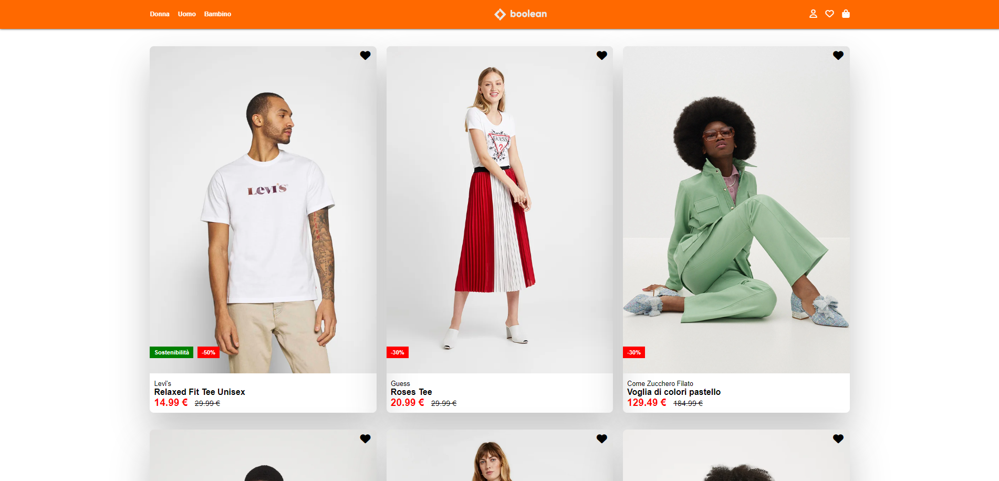

# Vue E-commerce Project

## Descrizione del Progetto
Questo progetto è una riproduzione di un e-commerce simile a Zalando.it, sviluppato utilizzando Vue.js. L'applicazione è completamente responsive e offre un'esperienza utente fluida su dispositivi di diverse dimensioni.

## Caratteristiche principali

### Catalogo prodotti
- Visualizzazione di prodotti in una griglia responsive
- Ogni prodotto mostra immagine, marca, nome, prezzo e eventuali sconti

### Lista dei preferiti
- Gli utenti possono aggiungere/rimuovere prodotti dalla lista dei preferiti
- Un contatore dinamico nell'header mostra il numero di prodotti nei preferiti

### Dettagli prodotto in modale
- Cliccando sul nome del prodotto si apre una modale con:
  - Slider di immagini del prodotto
  - Dettagli completi del prodotto
  - Pulsante per l'acquisto

### Design responsive
- Layout fluido che si adatta a schermi di diverse dimensioni
- Menu hamburger per la navigazione su dispositivi mobili

## Tecnologie utilizzate

- Vue.js 3
- Bootstrap 5
- Sass per lo styling
- Font Awesome per le icone

## Struttura del progetto

Il progetto è organizzato in componenti Vue, ciascuno responsabile di una specifica funzionalità:

- `AppHeader.vue`: Navbar responsive con logo, link di navigazione e icone utente
- `ProductCard.vue`: Card del prodotto con immagine, dettagli e funzionalità "preferiti"
- `ProductModal.vue`: Modale con slider immagini e dettagli del prodotto
- `AppLogo.vue`: Componente logo
- `ProductList.vue`: Contenitore principale per la visualizzazione dei prodotti

## Visualizzare il progetto

Si può visionare il progetto a questo indirizzo https://marinodilauro.github.io/vite-boolando/